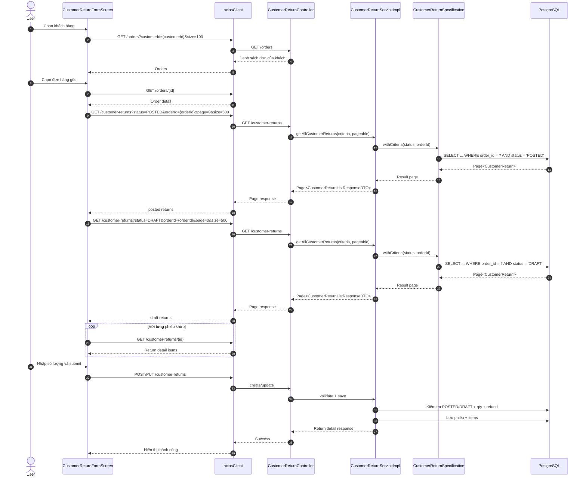
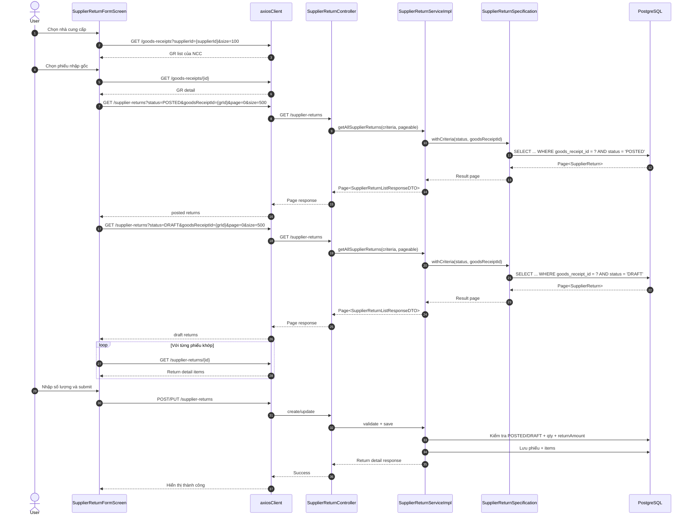

# Return Flow Sequence Notes

**Date:** 2026-05-03

## Mục tiêu
Tài liệu này tổng hợp lại nội dung memory đã lưu và mô tả chi tiết luồng xử lý cho các chức năng trả hàng để dễ vẽ sequence diagram.

## Kết luận chính
- Danh sách phiếu trả hàng và kiểm kho đang dùng **server-side filtering** qua `DataTableScreen` + `useTablePagination` + `SearchCriteria` + `Specification`.
- Các màn form trả hàng có một phần tính toán số lượng còn có thể trả bằng cách gọi danh sách phiếu liên quan, nhưng hiện đã tối ưu lại để **lọc theo `orderId` / `goodsReceiptId` ngay trên endpoint list hiện có**.
- Frontend vẫn có bước gom dữ liệu từ các phiếu khớp để tính `postedQty`, `pendingQty`, `availableQty`, `postedRefund`, `pendingRefund`, `availableRefund`.
- Backend vẫn là nơi chặn nghiệp vụ thật: vượt số lượng được trả, vượt giá trị hoàn, trả phiếu không đúng trạng thái, hoặc người dùng không có quyền.

---

## 1. Danh sách phiếu trả hàng không phải getAll rồi lọc UI

### Danh sách trả hàng khách
Luồng thực tế:

1. `CustomerReturnListScreen` render `DataTableScreen` với `apiUrl="/customer-returns"`.
2. Người dùng chọn filter ngày / trạng thái / kho.
3. `renderFilters()` gọi `setFilters()`.
4. `useTablePagination` chuyển filter thành query params.
5. Frontend gọi:
   - `GET /customer-returns?page=...&size=...&status=...&fromDate=...&toDate=...`
6. `CustomerReturnController` nhận `CustomerReturnSearchCriteria`.
7. `CustomerReturnServiceImpl` gọi `CustomerReturnSpecification.withCriteria(criteria)`.
8. `CustomerReturnRepository.findAll(spec, pageable)` lọc tại DB.
9. Backend trả về `Page<CustomerReturnListResponseDTO>`.
10. Frontend chỉ render dữ liệu đã phân trang.

### Danh sách trả hàng NCC
Luồng tương tự với `SupplierReturnListScreen`:

1. `SupplierReturnListScreen` render `DataTableScreen`.
2. Filter được đẩy qua query params.
3. Backend lọc bằng `SupplierReturnSpecification`.
4. DB trả về dữ liệu theo trang.

---

## 2. Luồng chi tiết của form trả hàng khách

### Mục tiêu của form
Form cần biết cho từng sản phẩm trong đơn gốc:
- Đã mua bao nhiêu
- Đã trả bao nhiêu
- Đang chờ duyệt bao nhiêu
- Có thể trả tối đa bao nhiêu
- Có thể hoàn tối đa bao nhiêu

### Luồng frontend
File: `frontend/src/features/customer-returns/screens/CustomerReturnFormScreen.tsx`

#### Khi chọn khách hàng
1. Gọi `GET /orders?customerId={customerId}&size=100` để lấy danh sách đơn của khách đó.
2. UI chỉ hiển thị danh sách đơn của khách đang chọn.
3. Đây là lọc theo khách hàng phục vụ form, không phải màn danh sách phiếu.

#### Khi chọn đơn hàng gốc
1. Gọi `GET /orders/{id}` để lấy chi tiết đơn hàng.
2. Gọi `buildOrderItemReturnStats(order.id)` để tính thống kê phiếu trả liên quan.
3. Hàm này hiện gọi:
   - `GET /customer-returns?status=POSTED&orderId={orderId}&page=0&size=500...`
   - `GET /customer-returns?status=DRAFT&orderId={orderId}&page=0&size=500...`
4. Backend lọc ngay theo `orderId` và `status`.
5. Với từng phiếu trả khớp, frontend gọi thêm `GET /customer-returns/{id}` để lấy item chi tiết.
6. Frontend cộng dồn theo `orderItemId` để tính:
   - `postedByOrderItemId`
   - `pendingByOrderItemId`
   - `postedRefundByOrderItemId`
   - `pendingRefundByOrderItemId`
7. Từ đó form tính:
   - `availableQty = purchasedQty - returnedQty - pendingQty`
   - `availableRefund = lineRevenue - postedRefund - pendingRefund`
8. Khi user nhập số lượng vượt `availableQty`, UI chặn trước.

#### Khi submit
1. Frontend dựng payload với `customerId`, `orderId`, `warehouseId`, `items`.
2. Nếu là form sửa thì gọi `PUT /customer-returns/{id}`.
3. Nếu là tạo mới thì gọi `POST /customer-returns`.
4. Backend kiểm tra lại toàn bộ nghiệp vụ trước khi lưu.

### Luồng backend
File: `backend/src/main/java/IUH/KLTN/LvsH/service/impl/CustomerReturnServiceImpl.java`

#### Khi tạo / cập nhật
- `validateItemList()` kiểm tra item rỗng, số lượng > 0, tiền hoàn >= 0.
- `validateAgainstOrderItemLimits()` kiểm tra:
  - Số lượng đã trả `POSTED`
  - Số lượng đang chờ duyệt `DRAFT`
  - Số lượng yêu cầu mới
  - Không được vượt số lượng bán ra của `OrderItem`
  - Không được vượt `lineRevenue`

#### Khi hoàn tất phiếu
- Chuyển trạng thái sang `POSTED`.
- Tạo `InventoryMovement` kiểu `RETURN_IN`.
- Đây là điểm nghiệp vụ thật, không phụ thuộc UI.

---

## 3. Luồng chi tiết của form trả hàng NCC

File: `frontend/src/features/supplier-returns/screens/SupplierReturnFormScreen.tsx`

### Khi chọn nhà cung cấp
1. Gọi `GET /goods-receipts?supplierId={supplierId}&size=100` để lấy phiếu nhập của NCC.
2. UI chỉ hiển thị GR thuộc NCC đang chọn.

### Khi chọn phiếu nhập gốc
1. Gọi `GET /goods-receipts/{id}` để lấy chi tiết phiếu nhập.
2. Gọi `buildGrItemReturnStats(gr.id)`.
3. Hàm này hiện gọi:
   - `GET /supplier-returns?status=POSTED&goodsReceiptId={grId}&page=0&size=500...`
   - `GET /supplier-returns?status=DRAFT&goodsReceiptId={grId}&page=0&size=500...`
4. Backend lọc ngay theo `goodsReceiptId` và `status`.
5. Với từng phiếu trả khớp, frontend gọi thêm `GET /supplier-returns/{id}` để lấy item chi tiết.
6. Frontend cộng dồn theo `goodsReceiptItemId` để tính:
   - `postedByGrItemId`
   - `pendingByGrItemId`
7. Từ đó form tính:
   - `availableQty = receivedQty - returnedQty - pendingQty`
8. Khi người dùng nhập số lượng vượt `availableQty`, UI chặn trước.

### Khi submit
1. Frontend dựng payload với `supplierId`, `goodsReceiptId`, `warehouseId`, `items`.
2. Nếu là sửa thì gọi `PUT /supplier-returns/{id}`.
3. Nếu là tạo mới thì gọi `POST /supplier-returns`.
4. Backend validate lại trước khi lưu.

### Luồng backend
File: `backend/src/main/java/IUH/KLTN/LvsH/service/impl/SupplierReturnServiceImpl.java`

#### Khi tạo / cập nhật
- `validateItemList()` kiểm tra item rỗng, số lượng > 0, tiền hoàn >= 0.
- `validateAgainstGoodsReceiptItemLimits()` kiểm tra:
  - Số lượng đã trả `POSTED`
  - Số lượng đang chờ duyệt `DRAFT`
  - Số lượng yêu cầu mới
  - Không được vượt số lượng nhập `receivedQty`
  - Không được vượt `lineTotal`

#### Khi hoàn tất phiếu
- Chuyển trạng thái sang `POSTED`.
- Tạo `InventoryMovement` kiểu `RETURN_OUT`.
- Đây là chặn nghiệp vụ thật của hệ thống.

---

## 4. Vì sao vẫn có getAll ở form nhưng không phải getAll rồi lọc toàn bộ UI

Điểm dễ gây hiểu nhầm là form có gọi danh sách phiếu `POSTED` và `DRAFT`. Tuy nhiên:

- Nó **không** lấy toàn bộ phiếu rồi lọc ở frontend bằng mảng lớn của toàn hệ thống.
- Nó chỉ lấy **danh sách có điều kiện** theo `status` và `orderId` / `goodsReceiptId`.
- Sau đó frontend mới lọc tiếp để nhóm theo item và tính số lượng còn lại.

Vì vậy luồng đúng là:

`Frontend form` → `List API có filter` → `Backend Specification` → `Database` → `Frontend tính stats theo item`

Không phải:

`Frontend get all toàn bộ phiếu` → `lọc tay ở UI` → `hiển thị danh sách`

---

## 5. Bản đồ sequence để vẽ

### A. Trả hàng khách
1. User mở form trả hàng KH.
2. User chọn khách hàng.
3. Frontend gọi list đơn hàng của khách.
4. User chọn đơn hàng gốc.
5. Frontend gọi chi tiết đơn hàng.
6. Frontend gọi list phiếu trả KH theo `orderId` + `status`.
7. Backend lọc ở DB và trả về danh sách phiếu liên quan.
8. Frontend gọi detail từng phiếu để tính stats item.
9. Frontend hiển thị `availableQty`, `availableRefund`.
10. User nhập số lượng và submit.
11. Backend validate lại và lưu phiếu.
12. Nếu hợp lệ, backend chuyển trạng thái và ghi inventory movement.

### B. Trả hàng NCC
1. User mở form trả hàng NCC.
2. User chọn NCC.
3. Frontend gọi list GR của NCC.
4. User chọn GR gốc.
5. Frontend gọi chi tiết GR.
6. Frontend gọi list phiếu trả NCC theo `goodsReceiptId` + `status`.
7. Backend lọc ở DB và trả về phiếu liên quan.
8. Frontend gọi detail từng phiếu để tính stats item.
9. Frontend hiển thị `availableQty`.
10. User nhập số lượng và submit.
11. Backend validate lại và lưu phiếu.
12. Nếu hợp lệ, backend chuyển trạng thái và ghi inventory movement.

---

## 6. Ghi chú kỹ thuật

- Danh sách màn hình dùng server-side filtering thông qua `DataTableScreen` và `useTablePagination`.
- Form trả hàng hiện dùng thêm filter `orderId` / `goodsReceiptId` để giảm dữ liệu tải về.
- Backend vẫn là nơi quyết định cuối cùng về giới hạn số lượng và giá trị hoàn trả.
- Nếu muốn tối ưu thêm, có thể tách phần tính tổng `postedQty` / `pendingQty` sang backend, nhưng bản hiện tại đã an toàn và ít thay đổi.

---

## 7. File liên quan

- `frontend/src/features/customer-returns/screens/CustomerReturnFormScreen.tsx`
- `frontend/src/features/supplier-returns/screens/SupplierReturnFormScreen.tsx`
- `frontend/src/features/customer-returns/screens/CustomerReturnListScreen.tsx`
- `frontend/src/features/supplier-returns/screens/SupplierReturnListScreen.tsx`
- `backend/src/main/java/IUH/KLTN/LvsH/service/impl/CustomerReturnServiceImpl.java`
- `backend/src/main/java/IUH/KLTN/LvsH/service/impl/SupplierReturnServiceImpl.java`
- `backend/src/main/java/IUH/KLTN/LvsH/repository/specification/CustomerReturnSpecification.java`
- `backend/src/main/java/IUH/KLTN/LvsH/repository/specification/SupplierReturnSpecification.java`

---

## 8. Mermaid sequence để vẽ nhanh

### A. Trả hàng khách

### B. Trả hàng NCC

